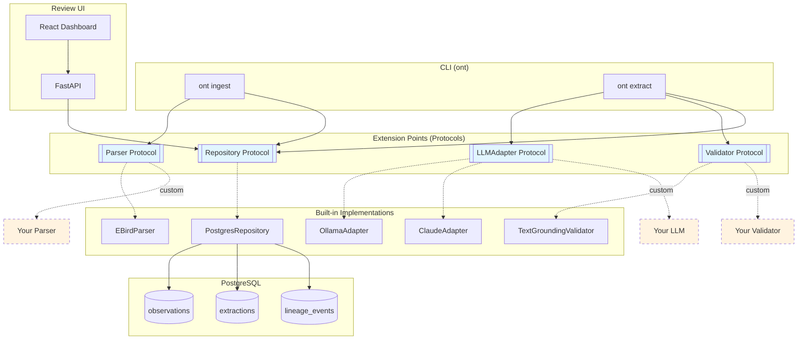

# Observation Note Tagger

Extract structured data from bird observation notes using LLMs.

## Problem

eBird contains 1.5+ billion bird observations. Many include free-text notes like:

> "Singing male on territory, tall oak at forest edge, 2 juveniles nearby"

This describes behavior, breeding evidence, habitat, and life stages — but it's buried in unstructured text. Researchers wanting to answer "show me all territorial behavior for Cuckoo in April" must manually read thousands of notes.

## Solution

A configurable pipeline that extracts structured data from observation notes:

```
INPUT:  "Singing from dead snag at forest edge. 2 fledglings begging nearby."

OUTPUT:
{
  "behaviors": [{"type": "singing", "context": "territorial"}],
  "breeding_evidence": {"code": "FL", "description": "fledglings begging"},
  "habitat_features": ["dead_snag", "forest_edge"],
  "life_stages": ["adult", "fledgling"]
}
```

## Quick Start

```bash
# Start services
docker compose up -d

# Run migrations
dbmate up

# Ingest EBD files
ont ingest --dir /path/to/ebd --workers 2

# Run extraction
ont extract --all --workers 2
```

## Features

### Ingest Pipeline
- **Parallel workers** — configurable concurrent file processing
- **Batch INSERT** — 1000 rows/batch, 7000+ rows/sec with parallel workers
- **Checkpointing** — resume from exact line after crash or Ctrl+C
- **Recursive discovery** — finds `ebd_*.txt` in subdirectories
- **Validation filtering** — skips invalid files (e.g., sampling files)
- **Graceful shutdown** — SIGINT/SIGTERM saves progress, no data loss

### Extraction Engine
- **Swappable LLM adapters** — Ollama (local, free), Claude, OpenAI
- **Parallel workers** — concurrent extraction with safe job claiming
- **Human-in-loop review** — low-confidence extractions routed for review
- **Retry logic** — configurable retries with exponential backoff

### Lineage Tracking
- **Full provenance** — trace any extraction back to source file + line
- **Event chain** — `ingested` → `extracted` → `reviewed`
- **Audit trail** — model version, prompt, response, latency logged

### Config-Driven Architecture
- **Repository layer** — all DB ops through Protocol interfaces
- **Swappable backends** — change via env vars, no code changes
- **Factory pattern** — composition root wires implementations

## CLI

```bash
# Ingest EBD files
ont ingest --dir <path> [--workers N] [--batch N] [--force] [--dry-run]

# Run extraction
ont extract [--all] [--workers N] [--batch N]
```

### Environment Variables

```bash
# Backend selection
ONT_REPO_BACKEND=postgres    # postgres | memory
ONT_LLM_ADAPTER=ollama       # ollama | claude | openai
ONT_PARSER=ebird             # ebird

# Ingest config
INGEST_BATCH_SIZE=1000
INGEST_MAX_RETRIES=3

# Extractor config
EXTRACTOR_BATCH_SIZE=10
EXTRACTOR_PARALLEL_WORKERS=1

# Ollama
OLLAMA_BASE_URL=http://localhost:11434
OLLAMA_MODEL=qwen2.5:7b
```

## Architecture



**Extension points** (light blue) are Protocol interfaces — implement them to add custom parsers, LLM backends, validators, or storage.

## Database Schema

- `observations` — raw observation data from EBD files
- `extractions` — structured data extracted by LLM
- `lineage_events` — provenance tracking for all entities
- `ingest_files` — file-level progress and checkpointing
- `ingest_failed_rows` — row-level error tracking

## Status

🔧 **Phase 3 Complete** — Review UI + validation layer

- [x] Phase 1: Extractor engine with parallel workers
- [x] Phase 2: Ingest pipeline with checkpointing
- [x] Phase 3: Review UI with TextGroundingValidator
- [ ] Phase 4: GraphQL API + Claude adapter
- [ ] Phase 5: Polish + deploy

## Packages

This project publishes **3 packages** for integration into your own pipelines:

| Package | Install | Use Case |
|---------|---------|----------|
| `birdlife-ont-core` | `pip install birdlife-ont-core` | Schemas, protocols, types — build custom adapters |
| `birdlife-ont` | `pip install birdlife-ont` | Full CLI + engines + adapters |
| `@birdlife-tools/ont-ui` | `npm install @birdlife-tools/ont-ui` | React review components |

### birdlife-ont-core

The core package exposes Protocol interfaces for building custom adapters:

```python
from birdlife_ont_core import LLMAdapter, ExtractionResult

class MyCustomAdapter:
    """Implements LLMAdapter protocol."""
    
    @property
    def name(self) -> str:
        return "my-adapter"
    
    @property
    def model_version(self) -> str:
        return "v1.0"
    
    async def extract(self, note: str, species: str) -> ExtractionResult:
        # Your extraction logic
        ...
```

### Schema Alignment

All packages depend on [`birdlife-schema`](https://github.com/birdlife-tools/birdlife-schema) for shared types. This ensures consistency across the birdlife-tools ecosystem.

## Community

[](https://matrix.to/#/#observation-note-tagger:matrix.org)

## License

MIT — see [LICENSE](LICENSE)
